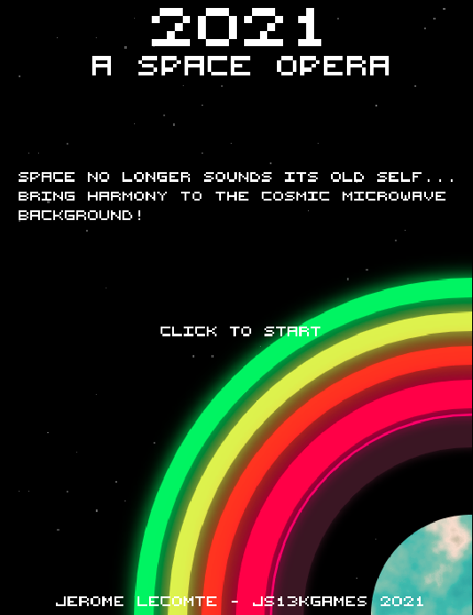

2021: a Space Odyssey
========

My game entry for JS13K Games 2021 on the theme "Space".

Getting Started
---------------

1. Run `npm install` to install all the build dependencies.

2. Run `npm start` to build the game and serve it locally into a new browser tab. Any changes to the source code will live-reload the game in the browser tab.

3. Run `npm run build` to build an optimized version of the game, packaged for JS13KGAMES submission.

Goal
-----
Space no longer sounds its old self... Bring harmony to the Cosmic Microwave Background by solving each planet's musical puzzle!

Each planet has an iconic space tune. Each ring of the planet is a note of the tune. Unfortunately, each tune was scrambled. Recompose the tune by swapping rings 2 by 2.

Wider rings mean longer notes. Colder ring colors mean lower notes, while warmer ring colors mean higher notes.
A hint will help you guess the tune of each planet.

Controls
--------
Drag and drop rings with mouse clicks (desktop) or tap (mobile). Rings will light up when they can be dropped.

Web Monetization
----------------
Coil subscribers get exclusive markers under each ring indicating if notes are correctly placed or not.

Special Thanks & Credits
------------------------
- Eoin McGrath for his original build script
- [Peters](https://twitter.com/p1100i) and [flo-](https://twitter.com/fl0ptimus_prime) for their pixel font from Glitch Hunter
- [Ryan Malm](https://twitter.com/ryanmalm) for sharing his Twitter message code
- [Maxime Euziere](https://twitter.com/MaximeEuziere) for his switch/case approach to handling game screens in update/render/input handlers
- Florent Cailhol for suggesting Terser in place of UglifyJS
- [Matt](https://twitter.com/Smflyf) for pointing out the existence of `advzip-bin`
- [Frank Force](https://twitter.com/KilledByAPixel) and [Keith Clark](https://keithclark.co.uk/) for their über smoll sound & music players, [ZzFX](https://github.com/KilledByAPixel/ZzFX) and [ZzFX Music](https://github.com/keithclark/ZzFXM) respectively
- [Steven Lambert](https://twitter.com/StevenKLambert) for his Pseudo Random Number Generator from Kontra.js
- Matt Deslaurier for [canvas-sketch-util](https://github.com/mattdesl/canvas-sketch-util)'s lerp functions
- [Maxime Euziere](https://twitter.com/MaximeEuziere) again for his [miniPiano](https://github.com/xem/miniPiano) tool, and [Crystal Parker](https://twitter.com/vertfromageio) for annotating his code so it could be easily integrated in my game.
